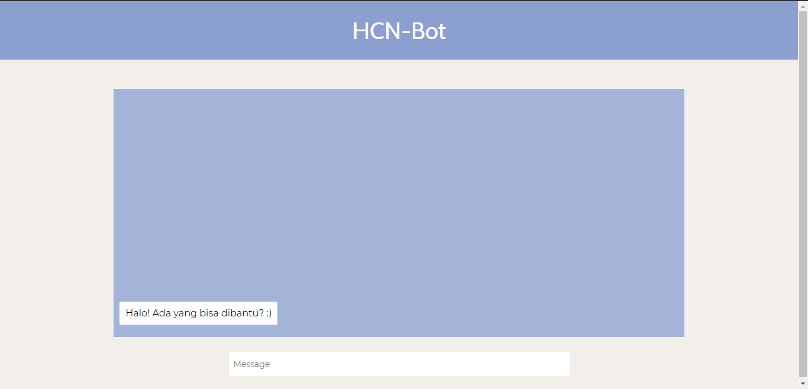

# **Deskripsi Program**
========================
Aplikasi ChatBot (HCNBot) merupakan suatu bot yang dapat menyimpan daftar deadline tugas yang Anda miliki. Selain menyimpan data tugas/task, Anda juga dapat menampilkan data - data deadline tersebut berdasarkan kata kunci yang Anda masukan. Aplikasi ini memanfaatkan algoritma String Matching Boyer Moore dan Regular Expression untuk pencocokan string.

## **Screenshots**
========================
### Tampilan Awal

## **Algoritma Program**
========================
- Algoritma Pencocokan String Booyer Moore
- Regular Expression

## **Requirement Program dan Instalasi**
========================
- Program dijalankan pada sistem operasi Windows.
- Python 3
- Install beberapa library pada Python 3 : Flask, sqlite3

## **Petunjuk Penggunaan**
========================
1. Program dijalankan dengan environment Python 3. Pindahkan terminal ke directory src program dan jalankan main.py dengan command “py main.py”. Setelah itu akan muncul suatu link. Copy link tersebut pada browser Anda untuk dapat menjalankan bot deadline.
2. Atau Melalui aplikasi Visual Studio Code, jalankan file main.py. Setelah itu akan muncul suatu link. Copy link tersebut pada browser Anda untuk dapat menjalankan bot deadline.
3. Masukkan input Anda pada kolom yang telah disediakan
4. Setelah memasukkan input, program akan memproses inputan Anda dan akan menampilkan pesan respon terhadap inputan pengguna.

